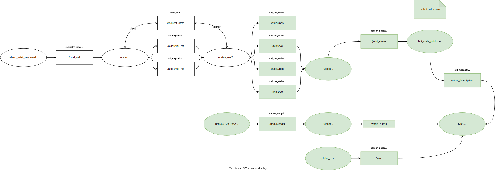
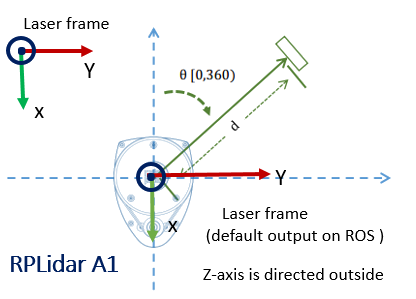

:tocdepth: 2

.. _perception:

Perception
==========
The concept of percetion, in the field of robotics, is to organize, identify and interpret sensor information 
in order to represent and understand the robot's surrounding environment. This is a crucial factor in any robotic
system that is supposed to do autonomous tasks. For a better description of the widely known see-think-act cycle, referred to as the foundation
in all autonomous operations, it is rewritten as a *percept*-think-act cycle.

Furthermore, there are a variety of different sensors and algorithms to equip a mobile robot with a sufficient
perception system. Among these are the most commonly used sensors; camera (vision), laser scanner (range), IMU (inertial),
GPS (global position) and wheel encoders (local position). Bumbers with built in switches are also a sensor widely used for indoor
mobile robots such as robot vacuum cleaners.

.. _perception perception_diagram:

    Figure: Perception diagram.

The UiAbot has the following sensors installed and implemented in this project:

- `CUI AMT102 Incremental Encoder <https://www.cuidevices.com/product/resource/amt10.pdf/>`_
- `Bosch-Sensortech BNO055 IMU <https://www.bosch-sensortec.com/products/smart-sensors/bno055//>`_
- `Slamtech RPLiDAR A1 <https://www.slamtec.com/en/Lidar/A1/>`_

Wheel Encoders
--------------
The installed rotary encoders is of type *incremental*, meaning they emit pulses, or ticks, as they spin. These ticks has to be counted on a processing unit 
in order to get the encoder position. Incremental encoders are cheaper than their counterpart, *absolute* encoders, but are limited to measuring change in 
position (relative). Anyhow, for the UiAbot we use these sensors to measure actual wheel speed.

The CUI AMT102 encoder has customizeable quadrature resolution up to 2048 PPR, which can be selected by the physical DIP-switches. The
combined CPR depends on the unit that is processing the pulses from the encoder. For a quadrature encoder it is possible to get a total
4xPPR. On our UiAbot, the encoder is set to 2048 PPR and the ODrive board maximizes this with hardware-interrupts on both *falling* and *rising*
edges, which results in a total of 8192 CPR.

The implementation of the encoder was done by extending the ``odrive_ros2`` node with a publisher that emits all the necessary feedback
data (motor position and velocity). The feedback data is published with msg-type `std_msgs/Float32 <http://docs.ros.org/en/noetic/api/std_msgs/html/msg/Float32.html>`_
on the relevant topics for each axis, as seen in figure above.

To visualize wheel motion in `Rviz2 <https://github.com/ros2/rviz>`_, an URDF is created with the mesh of the UiAbot including all relevant
frames and their pose relative to ``base_link``. Furthermore, an extension to the :ref:`uiabot_pkg mechanical_odometry`
node is added to publish the position of the two wheel joints as a `sensor_msgs/JointState <http://docs.ros.org/en/noetic/api/sensor_msgs/html/msg/JointState.html>`_ message 
on the ``/joint_states`` topic. Then, using the built-in `robot_state_publisher <https://github.com/ros/robot_state_publisher/tree/galactic>`_ with the URDF as an 
argument, the correct transforms is automatically updated and published to the ``/robot_description`` topic. Additionally, the static and dynamic TF's based on the URDF, 
is broadcasted for later usage.

The ``/robot_description`` topic can then be subscribed to in Rviz2, which then will visualize the robot and all its frames dynamically.

.. figure:: fig/wheel_tf.gif
  :align: center
  :width: 400

  Figure: Wheel encoder visualization in Rviz2.

.. note::
    Command to run the ``robot_state_publisher`` node: 

    .. code-block:: bash

        ros2 run robot_state_publisher robot_state_publisher --ros-args -r robot_description:=<URDF as a string>
    
    This node should be ran in a launch file for a correct parsing of the URDF in string format.
        

Inertial Measurement Unit (IMU)
-------------------------------
The IMU consists of an accelerometer, gyroscope and magnetometer. Each of the three sensors are 3-axis resulting in a total 9DOF sensor. Additionally, the
`BNO055 <https://www.bosch-sensortec.com/products/smart-sensors/bno055//>`_ has an onboard processing unit which calculates the absolute orientation of the
sensor in 3D-space. In the UiAbot project, the IMU is used to achieve a more accurate heading measurement.

There are two possible communication peripherals on the chip, UART and I²C.
In our case, it was preferred to use the default I²C interface. There is a ROS2 package that already exists, in which implements the I²C communication
with the IMU, but due to some calibration problems it did not perferm very well on our system. The solution was to rewrite a ROS(1) package to be usable with ROS2.
This package was named :ref:`bno055_i2c_ros2_pkg` and has a node, equally named, that publishes the same data as the original ROS(1) node.

The IMU is connected to I²C bus 1 on the jetson. Checking with command ``i2cdetect -y -r 1`` should return a device with ``ID=28``.

As seen in the diagram on top, the used topic is the ``/bno055/data``, which consists of the fused and filtered absolute data from the IMU.

.. note::
    Command to run the ``bno055_i2c_ros2`` node: 

    .. code-block:: bash

        ros2 run bno055_i2c_ros2 bno055_i2c_ros2

Visualizing the IMU orientation was done by the creation of an additional node in the :ref:`uiabot_pkg` package, named :ref:`uiabot_pkg imu_tf_viz`. This node broadcasts
the TF of an ``imu`` frame relative to a fixed ``world`` frame, which then can be seen in Rviz2.

.. figure:: fig/imu_tf.gif
  :align: center
  :width: 500

  Figure: IMU orientation visualization in Rviz2.

.. note::
    Command to run the ``imu_tf_viz`` node: 

    .. code-block:: bash

        ros2 run uiabot imu_tf_viz

    This node is only used during this section to visualize IMU orientation alone and is not a part of the complete system.

LiDAR
-----
In order to be able to perform localization in, as well as mapping, the robot's environment, the UiAbot has a LiDAR from Slamtech installed. A LiDAR is a method 
for determining ranges (variable distance) by targeting an object or a surface with a laser and measuring the time for the reflected light to return to the receiver.

The `RPLiDAR A1 <https://www.slamtec.com/en/Lidar/A1/>`_ is a 360 degree 2D laser which is capable of measuring distances up to 12 meters. The scan rate defaults to
5.5 Hz, which results in 8000 samples per second and an angular resolution of about 1 degree.

  Figure: RPLiDAR A1 frame configuration.

To get the LiDAR on the ROS2 network, a package made by Slamtech is used. The package is named `rplidar_ros <https://github.com/Slamtec/rplidar_ros/tree/ros2>`_ and 
its installation instructions is stated in :ref:`installation`. Launching the ``rplidar_composition`` node using the built-in launch file with default arguments, 
will publish a `sensor_msgs/LaserScan <http://docs.ros.org/en/melodic/api/sensor_msgs/html/msg/LaserScan.html>`_ message to the ``/scan`` topic. This message has a 
*frame_id* parameter that defaults to ``bno055``. This frame is set up as a static link in the robot's URDF using the same name. The orientation of of the 
broadcasted frame match with the figure above.

The laser scan visualization in Rviz2 is done by adding a LaserScan subscriber to the ``/scan`` topic.

.. figure:: fig/laser_scan.gif
  :align: center
  :width: 500

  Figure: Laser scan visualization in Rviz2.

.. note::
    Command to launch the ``rplidar_composition`` node: 

    .. code-block:: bash

        ros2 launch rplidar_ros rplidar_launch.py
    
    The execution of this node is integrated in custom UiAbot launch files instead of using the launch file from the ``rplidar_ros`` package.
