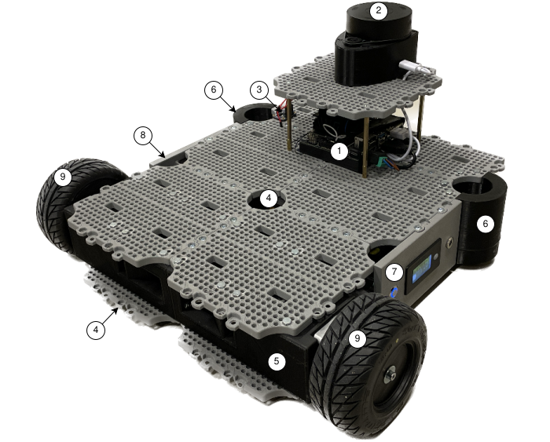
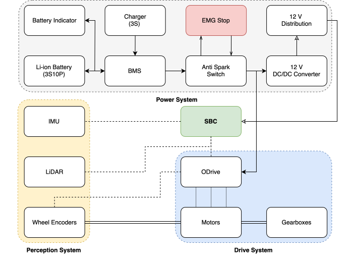
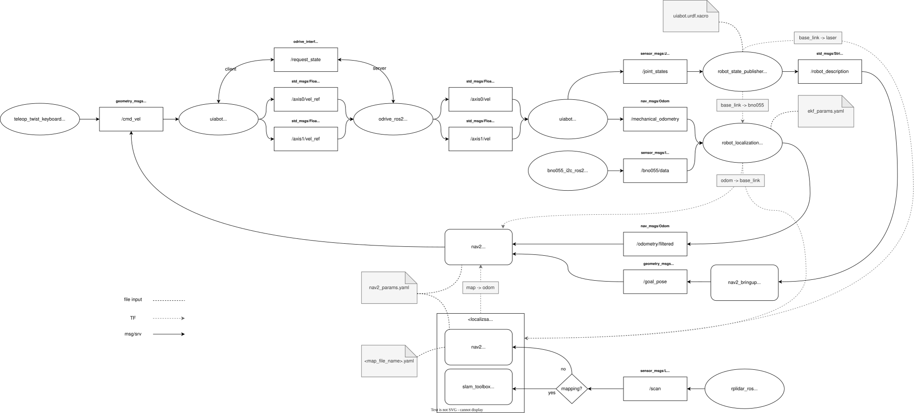
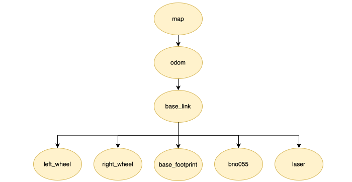

Introduction
===================

This is the main documentation for the UiAbot Autonomous Mobile Robot (AMR) platform developed at the University of Agder (UiA). The goal of the UiAbot is to introduce STEM students to software development, instrumentation, and the implementation of algorithms necessary for robots to operate autonomously using the Robotic Operating System framework (ROS 2). This documentation provides a brief introduction to several topics related to autonomous robotics, including motion control, perception, localization and mapping (SLAM), and motion planning and navigation.

The initial Single Board Computer (SBC) setup, which used the NVIDIA Jetson Nano running Ubuntu 20.04 (Jetpack 5) with ROS 2 Galactic, has been upgraded to a Jetson Orin Nano running Ubuntu 22.04 (Jetpack 6) with ROS 2 Humble. This upgrade enhances performance and enables support for advanced features, benefiting tasks such as data processing and sensor integration.
    
System Overview
--------------
The UiAbot was designed with a focus on flexibility and ease of integration, supporting ROS 2, robotic manipulators, and SBCs like Raspberry Pi and NVIDIA Jetson. It includes sensors such as cameras, encoders, LiDARs, and IMUs for enhanced perception. As shown in Fig. 1, the default setup features an NVIDIA Jetson Nano (1), wheel encoders, a LiDAR (2), and an IMU (3), enabling autonomous navigation. The chassis (4), inspired by TurtleBot3’s modular 'waffle plate' design, uses four full and two half-waffle plates. Structural support comes from the front motor-encoder-gearbox assembly (5) and rear spherical support wheels (6). The left side plate (7) contains the power button, battery status indicator, and charging port, while the right side plate (8) includes an emergency stop button for safety.

    Figure: The UiAbot with its default AMR setup, equipped with an SBC (1), a spinning LiDAR (2), and an IMU (3).

The UiAbot system architecture incorporates a 3D-printed chassis design for enhanced modularity along with a robust drive, power, and perception system, as shown below. 

    Figure: Schematic overview of the UiAbot systems architecture.

For more details about the platform design, please refer to the `UiAbot paper <https://ieeexplore.ieee.org/document/10664856>`_, which provides an in-depth explanation of the system's architecture, hardware components, and software integration.       

Software Architecture
--------------

The complete UiAbot software can perform autonomous navigation using both the pre-generated
static map, as well as do its own mapping of the environment. It proves that a autonomous mobile robot does not have to use
expensive sensors and computational hardware. The Nav2 software stack is virtually plug-and-play.

The diagram below describes the communication flow if everything was to be launched together. It does not show the actual 
message flow between all nodes due to its complexity with the numerous nodes that Nav2 launches.

    
    Figure: System communication diagram.

Additionally, an overview of the TF tree is shown below. The ``base_link`` and ``base_footprint`` is basically the same frame with
different names. The reason for having both is because there are differences of what TF some of the 3rd party packages uses as the
reference for the robot relative to ``odom`` and ``map`` frames.

    Figure: Detailed view of the UiAbot´s TF tree.

Detailed step-by-step implementation of the UiAbot software is described in the Testing and Implementation section. 
