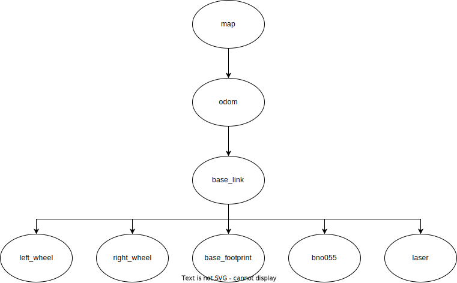

Project Conclusion
======================

The final outcome of this project is a system on the UiAbot that can perform autonomous navigation using both the pre-generated
static map, as well as do itsown mapping of the environment. It proves that a autonomous mobile robot does not have to use
expensive sensors and computational hardware. The Nav2 software stack is virtually plug-and-play.

The diagram below describes the communication flow if everything was to be launched together. It does not show the actual 
message flow between all nodes due to its complexity with the numerous nodes that Nav2 launches.

.. figure:: fig/system_architecture.drawio.svg
    :width: 1000
    :align: center
    
    Figure: System communication diagram.

The project has been an educational and fun way to learn more about autonomous systems. Further work will be to fine-tune the
``nav2_params.yaml`` file in order to make the velocity controller a little bit more smooth.

    Figure: System tf2 diagram.

Additionally, an overview of the TF tree is shown above. The ``base_link`` and ``base_footprint`` is basically the same frame with
different names. The reason for having both is because there are differences of what TF some of the 3rd party packages uses as the
reference for the robot relative to ``odom`` and ``map`` frames.

