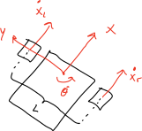

:tocdepth: 2

.. _motion_control:

Motion Control
==============
Motion control is all about making the robot move. This is done by creating a reference for the desired motion, given in the robot local coordinates. Typically, a linear and angular velocity. The forward kinematics then transforms these references to the required wheel velocity references. The wheel velocity references are sent to the controller board, which actuates the wheels. The actual wheel velocities are found using wheel encoders. This data is available from the controller board, and is sent to the mechanical odometry.

The figure below illustrates how this is implemented in ROS 2.

.. _motion_control motion_control_diagram:

.. figure:: fig/motion_control.drawio.svg
    :width: 1000
    :align: center

    Figure: Motion control communication diagram.

Motion Reference
----------------
The motion references for the uiabot is linear and angular velocities, given in the local coordinate frame. Generating these references are done by publishing the desired linear and angular velocity in a `geometry_msgs/Twist <http://docs.ros.org/en/noetic/api/geometry_msgs/html/msg/Twist.html>`_ message to the ``/cmd_vel`` topic.

The figure above shows this by using the built-in ``teleop_twist_keyboard`` node, that converts keyboard input to linear and angular velocity. Another solution would be to create a node that generates a trajectory and publishes a `geometry_msgs/Twist <http://docs.ros.org/en/noetic/api/geometry_msgs/html/msg/Twist.html>`_ message to the ``/cmd_vel`` topic.

.. note::
    Command to run the ``teleop_twist_keyboard`` node:

    .. code-block:: bash

        ros2 run teleop_twist_keyboard teleop_twist_keyboard
        
.. _motion_control inverse_kinematics:

Inverse Kinematics
------------------
To transform the linear and angular velocity references to wheel amgular velocity references we need the inverse kinematics of the robot. The following figure defines the robot local coordinate system, and positive linear wheel velocites.

    Figure: Robot definition.

Each wheel has the linear velocities :math:`\dot{x_r}` and :math:`\dot{x_l}`, corresponding to right and left wheels, respectively. As shown in the figure below, the wheel angular velocity is denoted by :math:`\dot{\phi}`, and wheel radius by :math:`r`.

    Figure: Wheel definition.

The linear velocities for the wheels can be written as.

.. math::
   \dot{x}_{r} = \dot{\phi}_{r}r \\
   \dot{x}_{l} = \dot{\phi}_{l}r
   :label: linear_vel_wheel

| **Considering pure translational velocity**
| We first consider that the robot has pure translational velocity. Since we are looking at the robot in the local coordinate frame, the linear velocity is composed of a velocities along the x- and y-axis. However, assuming zero slip, which means :math:`\dot{y}=0`. The linear velocity is only :math:`\dot{x}`. For the robot to have pure translation velocity, both wheels will need to have the same angular velocities. This yields the following equation.

.. math::
    \begin{align}
        \dot{x}_{r} = \dot{x}_{l} = \dot{x} \\
        \Rightarrow \dot{\phi}_{r}r = \dot{\phi}_{l}r = \dot{x} \\
        \Rightarrow \dot{\phi}_{r} = \dot{\phi}_{l} = \frac{\dot{x}}{r}
    \end{align}
    :label: trans_vel

| **Considering pure angular velocity**
| We then consider that the robot has pure rotational velocity. The robot rotational velocity is denoted as :math:`\dot{\theta}`. For the robot to have pure rotational velocity, the wheels will need to have opposite angular velocites.

.. math::
    \dot{\phi}_{r} = -\dot{\phi}_{l}
    :label: rot_vel_opposite

Assuming no lateral movement, the wheels must follow a circle, which yields the following equations for the right :eq:`rot_vel_r` and left wheel :eq:`rot_vel_l`.

.. math::
    \dot{\phi}_{r}r = \frac{L}{2}\dot{\theta} \Rightarrow \dot{\phi}_{r} = \frac{L}{2}\frac{\dot{\theta}}{r}
    :label: rot_vel_r

.. math::
    \dot{\phi}_{l}r = -\frac{L}{2}\dot{\theta} \Rightarrow \dot{\phi}_{l} = -\frac{L}{2}\frac{\dot{\theta}}{r}
    :label: rot_vel_l

| **Combining the velocities**
| Since both the definintion of the linear :eq:`r_wheel` and angular velocites are valid in vector-space, these can be added together for the right and left wheel in equation :eq:`r_wheel` and :eq:`l_wheel`. This yields expressions for the wheel angular velocities, :math:`\dot{\phi}_r` and :math:`\dot{\phi}_l`, given the linear and angular robot velocites, :math:`\dot{x}` and :math:`\dot{\theta}`.

.. math::
    \dot{\phi}_{r} = \frac{\dot{x}}{r} + \frac{L}{2}\frac{\dot{\theta}}{r}
    :label: r_wheel

.. math::
    \dot{\phi}_{l} = \frac{\dot{x}}{r} - \frac{L}{2}\frac{\dot{\theta}}{r}
    :label: l_wheel

The inverse kinematics can then be written in matrix form as.

.. math:: 
    \begin{bmatrix}\dot{\phi}_r \\ \dot{\phi}_l \end{bmatrix} = \frac{1}{r} \begin{bmatrix}1 & \frac{L}{2} \\ 1 & -\frac{L}{2}  \end{bmatrix}\begin{bmatrix}\dot{x} \\ \dot{\theta}\end{bmatrix}
    :label: inverse_kinematics

The inverse kinematics of the robot is implemented in the :ref:`uiabot_pkg control` node.

.. note::
    Command to run the ``control`` node:

    .. code-block:: bash

        ros2 run uiabot control

.. _motion_control forward_kinematics:

Forward Kinematics
------------------

The forward kinematics is used to transform wheel angular velocities, :math:`\dot{\phi}_r` and :math:`\dot{\phi}_l`, to robot angular and linear velocities, :math:`\dot{x}` and :math:`\dot{\theta}`, given in the local coordinate frame. Based on equation :eq:`inverse_kinematics` from the inverse kinematics, we can solve for :math:`\dot{x}` and :math:`\dot{\theta}`. Which gives the following equation.

.. math::
    \begin{bmatrix}\dot{x} \\ \dot{\theta}\end{bmatrix} = \begin{bmatrix}\frac{r}{2} & \frac{r}{2} \\ \frac{L}{2} & -\frac{L}{2}\end{bmatrix} \begin{bmatrix}\dot{\phi}_r \\ \dot{\phi}_l \end{bmatrix}
    :label: forward_kinematics

The forward kinematics of the robot is implemented in the :ref:`uiabot_pkg mechanical_odometry` node.

.. note::
    Command to run the ``mechanical_odometry`` node:

    .. code-block:: bash

        ros2 run uiabot mechanical_odometry

.. _motion_control controller:

Motor Controller
----------------
On the uiabot, the motors are driven by a ODrive controller board, which is connected to the Jetson Nano through USB. To make the ODrive available on the ROS 2 network, an interface node is created: :ref:`odrive_ros2_pkg odrive_ros2`. This node makes it possible to publish velocity references to each wheel.

.. note::
    Command to run the ``odrive_ros2`` node:

    .. code-block:: bash

        ros2 run odrive_ros2 odrive_ros2 
