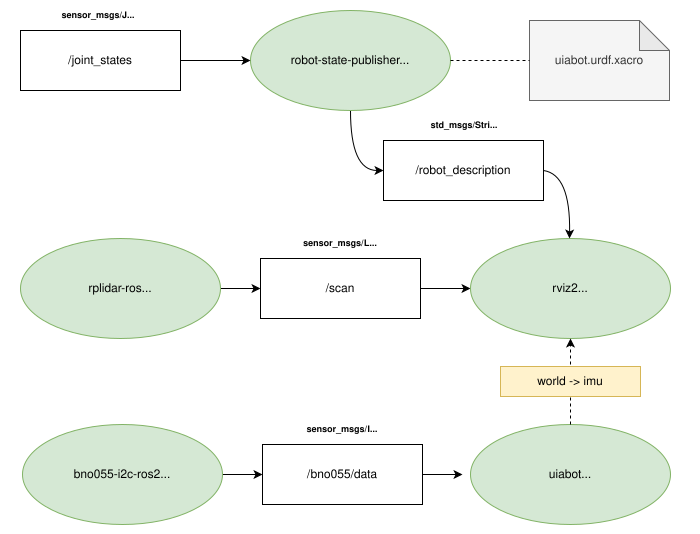
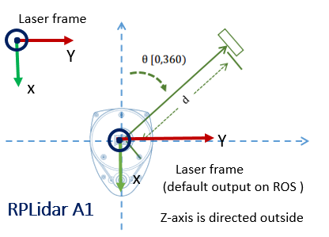

:tocdepth: 2

.. _perception:

Perception
==========
The concept of percetion, in the field of robotics, is to organize, identify and interpret sensor information 
in order to represent and understand the robot's surrounding environment. This is a crucial factor in any robotic
system that is supposed to do autonomous tasks. 

The UiAbot perception system is a complex integration of various sensors, each of which feeds data into the ROS 2 ecosystem for comprehensive environmental awareness. The figure below illustrates the connection between sensor data, ROS 2 nodes, and the visualization tools used to represent sensor data in Rviz2.

.. _perception perception_diagram:

    Figure: Diagram illustrating the UiAbot perception system integrated with ROS 2. Note: The wheel_tf_publisher node (which publishes joint states) is not shown in this diagram but is part of the complete perception pipeline.

The UiAbot has the following sensors installed and implemented in this project:

- `CUI AMT102 Incremental Encoder <https://www.cuidevices.com/product/resource/amt10.pdf/>`_
- `Bosch-Sensortech BNO055 IMU <https://www.bosch-sensortec.com/products/smart-sensors/bno055//>`_
- `Slamtech RPLiDAR A1 <https://www.slamtec.com/en/Lidar/A1/>`_

Wheel Encoders
--------------
The installed rotary encoders is of type *incremental*, meaning they emit pulses, or ticks, as they spin. These ticks has to be counted on a processing unit  in order to get the encoder position. Incremental encoders are cheaper than their counterpart, *absolute* encoders, but are limited to measuring change in  position (relative). Anyhow, for the UiAbot we use these sensors to measure actual wheel speed.

The CUI AMT102 encoder has customizeable quadrature resolution up to 2048 PPR, which can be selected by the physical DIP-switches. The combined CPR depends on the unit that is processing the pulses from the encoder. For a quadrature encoder it is possible to get a total 4xPPR. On our UiAbot, the encoder is set to 2048 PPR and the ODrive board maximizes this with hardware-interrupts on both *falling* and *rising* edges, which results in a total of 8192 CPR.

The implementation of the encoder was done by extending the ``odrive_ros2`` node with a publisher that emits all the necessary feedback data (motor position and velocity). The feedback data is published with msg-type `std_msgs/Float32 <http://docs.ros.org/en/noetic/api/std_msgs/html/msg Float32.html>`_on the relevant topics for each axis, as seen in figure above.

To visualize wheel motion in `Rviz2 <https://github.com/ros2/rviz>`_, an URDF is created with the mesh of the UiAbot including all relevant frames and their pose relative to ``base_link``. 

The wheel joint state publishing functionality has been separated into a dedicated ``wheel_tf_publisher`` node. This node reads the wheel encoder data and publishes the position of the two wheel joints as a `sensor_msgs/JointState <http://docs.ros.org/en/noetic/api/sensor_msgs/html/msg/JointState.html>`_ message on the ``/joint_states`` topic.

Then, using the built-in `robot_state_publisher <https://github.com/ros/robot_state_publisher/tree/humble>`_ with the URDF as an argument, the correct transforms are automatically updated and published to the ``/robot_description`` topic. Additionally, the static and dynamic TF's based on the URDF are broadcasted for later usage.

The ``/robot_description`` topic can then be subscribed to in Rviz2 on the remote PC, which then will visualize the robot and all its frames dynamically.

.. figure:: res/wheel_tf.gif
  :align: center
  :width: 400

  Figure: Wheel encoder visualization in Rviz2.

.. note::
    Commands to run the wheel transform publishing pipeline:

    1. First, run the following command on the **jetson** to run the ``wheel_tf_publisher`` node to publish joint states:

    .. code-block:: bash

        ros2 run uiabot wheel_tf_publisher

    2. Then, run the following command on the **jetson** to run the ``robot_state_publisher`` node to broadcast transforms: 

    .. code-block:: bash

        # First, process the xacro file to generate URDF XML
        xacro $(ros2 pkg prefix uiabot)/share/uiabot/urdf/wheel.urdf.xacro > /tmp/wheel.urdf
        
        # Then run robot_state_publisher with the processed URDF
        ros2 run robot_state_publisher robot_state_publisher --ros-args \
          -p robot_description:="$(cat /tmp/wheel.urdf)"

    3. Run the following command on the **remote pc** to visualize in RViz2:

    .. code-block:: bash

        rviz2

    Then in RViz2:
    
    - Set **Fixed Frame** to ``base_link`` in the Global Options
    - Add a **RobotModel** display by clicking "Add" → "By display type" → "RobotModel"
    - Set the **Description Topic** to ``/robot_description``
    - Add a **TF** display by clicking "Add" → "By display type" → "TF"
    - You should see the robot mesh with wheel joints that update based on encoder feedback

    4. Note: The above commands only visualize encoder feedback. To actually drive the wheels and see them moving (as shown in the GIF above), follow the teleoperation instructions in the :ref:`motion_control` section.
        

Inertial Measurement Unit (IMU)
-------------------------------
The IMU consists of an accelerometer, gyroscope and magnetometer. Each of the three sensors are 3-axis resulting in a total 9DOF sensor. Additionally, the `BNO055 <https://www.bosch-sensortec.com/products/smart-sensors/bno055//>`_ has an onboard processing unit which calculates the absolute orientation of the sensor in 3D-space. In the UiAbot project, the IMU is used to achieve a more accurate heading measurement.

There are two possible communication peripherals on the chip, UART and I²C. In our case, it was preferred to use the default I²C interface. There is a ROS2 package that already exists, in which implements the I²C communication with the IMU, but due to some calibration problems it did not perform very well on our system. The solution was to rewrite a ROS(1) package to be usable with ROS2. This package was named :ref:`bno055_i2c_ros2_pkg` and has a node, equally named, that publishes the same data as the original ROS(1) node.

The IMU is connected to I²C bus 1 on the jetson. Checking with the following command on the **jetson**: ``i2cdetect -y -r 1`` should return a device with ``ID=28``.

As seen in the diagram on top, the used topic is the ``/bno055/data``, which consists of the fused and filtered absolute data from the IMU.

Visualizing the IMU orientation was done by the creation of an additional node in the :ref:`uiabot_pkg` package, named :ref:`uiabot_pkg imu_tf_viz`. This node broadcasts the TF of an ``imu`` frame relative to a fixed ``bno055`` frame, which then can be seen in Rviz2 on the remote PC.

.. figure:: res/imu_tf.gif
  :align: center
  :width: 500

  Figure: IMU orientation visualization in Rviz2.

.. note::
    Commands to visualize IMU orientation:

    1. Run the following command on the **jetson** to run the IMU driver node:

    .. code-block:: bash

        ros2 run bno055_i2c_ros2 bno055_i2c_ros2

    2. Run the following command on the **jetson** to run the IMU visualization node:

    .. code-block:: bash

        ros2 run uiabot imu_tf_viz

    3. Run the following command on the **remote pc** to visualize in RViz2:

    .. code-block:: bash

        rviz2

    Then in RViz2:
    
    - Set **Fixed Frame** to ``bno055`` in the Global Options
    - Add a **TF** display by clicking "Add" → "By display type" → "TF"
    - Enable "Show Names" and "Show Axes" in the TF display properties
    - You should see the ``imu`` frame rotating relative to the fixed ``bno055`` frame
    - Optionally add an **Imu** display and set the topic to ``/bno055/data`` to see the IMU data visualization

    Note: The ``imu_tf_viz`` node is only used during this section to visualize IMU orientation alone and is not a part of the complete system.

LiDAR
-----
In order to be able to perform localization in, as well as mapping, the robot's environment, the UiAbot has a LiDAR from Slamtech installed. A LiDAR is a method  for determining ranges (variable distance) by targeting an object or a surface with a laser and measuring the time for the reflected light to return to the receiver.

The `RPLiDAR A1 <https://www.slamtec.com/en/Lidar/A1/>`_ is a 360 degree 2D laser which is capable of measuring distances up to 12 meters. The scan rate defaults to
5.5 Hz, which results in 8000 samples per second and an angular resolution of about 1 degree.

  Figure: RPLiDAR A1 frame configuration.

To get the LiDAR on the ROS2 network, a package made by Slamtech is used. The package is named `rplidar_ros <https://github.com/Slamtec/rplidar_ros/tree/ros2>`_ and 
its installation instructions is stated in :ref:`installation`. Launching the ``rplidar_composition`` node using the built-in launch file with default arguments, 
will publish a `sensor_msgs/LaserScan <http://docs.ros.org/en/melodic/api/sensor_msgs/html/msg/LaserScan.html>`_ message to the ``/scan`` topic. This message has a 
*frame_id* parameter that defaults to ``bno055``. This frame is set up as a static link in the robot's URDF using the same name. The orientation of of the  broadcasted frame match with the figure above.

The laser scan visualization in Rviz2 on the remote PC is done by adding a LaserScan subscriber to the ``/scan`` topic.

.. figure:: res/laser_scan.gif
  :align: center
  :width: 500

  Figure: Laser scan visualization in Rviz2.

.. note::
    Commands to visualize LiDAR data:

    1. Run the following command on the **jetson** to launch the RPLiDAR node:

    .. code-block:: bash

        ros2 launch rplidar_ros rplidar_a1_launch.py

    2. Run the following command on the **remote pc** to visualize in RViz2:

    .. code-block:: bash

        rviz2

    Then in RViz2:
    
    - Set **Fixed Frame** to ``laser`` in the Global Options
    - Add a **LaserScan** display by clicking "Add" → "By display type" → "LaserScan"
    - Set the **Topic** to ``/scan``
    - Adjust visualization properties as desired:
        - **Size (m)**: 0.05 for point size
        - **Style**: Points, Flat Squares, or Spheres
        - **Color Transformer**: Intensity or FlatColor
    - You should see the laser scan data as points around the robot showing detected obstacles
    
    Note: The execution of this node is integrated in custom UiAbot launch files instead of using the launch file from the ``rplidar_ros`` package.

Visualizing mechanical odometry, LiDAR, and IMU
-----------------------------------------------

This guide launches all nodes required to drive the UiAbot remotely using the pc keyboard, in addition to the sensor nodes for the LiDAR and IMU. It also launches the mechanical odometry node which calculates the robot position relative to the intial frame. The robot description is also published to the network, which enables the visualization in RViz on the remote PC.

1. Run the following command on the **jetson** to launch the control and sensor nodes:

    .. code:: bash

        ros2 launch uiabot teleop_perception.launch.py

2. Run the following command on the **remote pc** to launch RViz:

    .. code:: bash

        rviz2 -d $(ros2 pkg prefix uiabot)/share/uiabot/rviz/perception.rviz

3. Follow the teleoperation instructions in the :ref:`motion_control` section to control the robot remotely.

