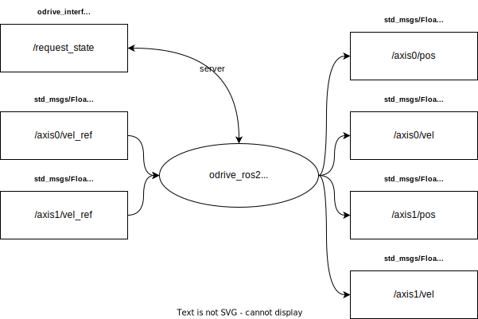

:tocdepth: 1

.. _bno055_i2c_ros2_pkg bno055_i2c_ros2:

bno055_i2c_ros2
===============

.. _bno055_i2c_ros2_pkg bno055_i2c_ros2_diagram:

    Figure: bno055_i2c_ros2 node diagram.

Summary
-------
This is a ROS2 node for the BNO055 IMU that communicates via I2C and without any dependencies besides libi2c-dev.
It is specifically targeted at using a BNO055 with NVIDIA boards such as the TX1, TX2, Xavier, Nano or any other board that has native I2C.

Parameters
----------

- ``device`` -- the path to the i2c device. Default is /dev/i2c-1. Use i2cdetect in the i2c-tools package to find out which bus your IMU is on.
- ``address`` -- the i2c address of the IMU. Default is 0x28.

Usage
-----

Run:

.. code-block:: bash

    ros2 run bno055_i2c_ros2 bno055_i2c_ros2

Interfaces
----------

Publishers
^^^^^^^^^^
============================         ================================           =============================
Topic                                Message type                               Description
============================         ================================           =============================
bno055/data                          sensor_msgs/Imu                            Fused IMU data.           
bno055/raw                           sensor_msgs/Imu                            Raw accelerometer data.
bno055/mag                           sensor_msgs/MagneticField                  Raw magnetic field data
bno055/temp                          sensor_msgs/Temperature                    Temperature data.
bno055/status                        diagnostic_msgs/DiagnosticStatus           A DiagnosticStatus object showing the current calibration, interrupt, system status of the IMU.
============================         ================================           =============================
