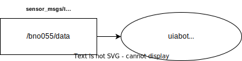

:tocdepth: 1

.. _uiabot_pkg imu_tf_viz:

imu_tf_viz
==========

.. _uiabot_pkg imu_tf_viz_diagram:

    Figure: imu_tf_viz node diagram.

Summary
-------
Subscribes to the fused data from the IMU on the UiAbot and broadcasts the orientation of a temporary ``imu`` frame w.r.t a ``world`` frame. This makes it possible to visualize the IMU orientation in RViz by choosing the ``world`` frame as the fixed frame, and adding the tf plugin to show the ``imu`` frame.

Usage
-----

Run:

.. code-block:: bash

    ros2 run uiabot imu_tf_viz

Interfaces
----------

Subscribers
^^^^^^^^^^^
============================         ============================           =============================
Topic                                Message type                           Description
============================         ============================           =============================
bno055/data                          sensor_msgs/Imu                        Fused IMU data.
============================         ============================           =============================